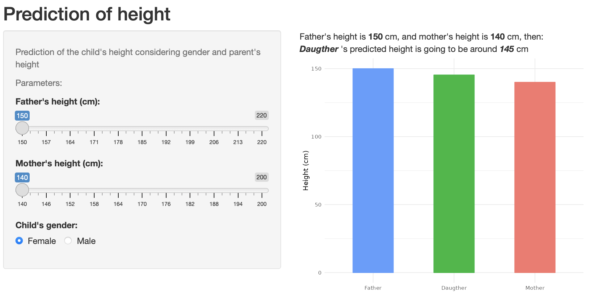

```{r setup, include=FALSE}
knitr::opts_chunk$set(echo = FALSE)
```

## About the Course Project

This is a deliverable for the course Developing Data Products as part of the Coursera Data Science Specialization.

Instructions:

1. Write a shiny application with associated supporting documentation. The documentation should be thought of as whatever a user will need to get started using your application.
2. Deploy the application on Rstudio's shiny server
3. Share the application link by pasting it into the provided text box
4. Share your Server.R and ui.R code on github

## How to use the application

Using the data provided by Galton Families dataset, we fit a linear model to predict a child's height based on the gender and parent's average height.

The application is running on (https://kamolcht.shinyapps.io/Shiny-Application-and-Reproducible-Pitch/)

ui.R, and Server.R Code in my github repository (https://github.com/kamolchanokTa/Shiny-Application-and-Reproducible-Pitch)

## Galton Families Dataset

The data used in the app comes from the GaltonFamilies dataset. 

## Sample
{width=50%}